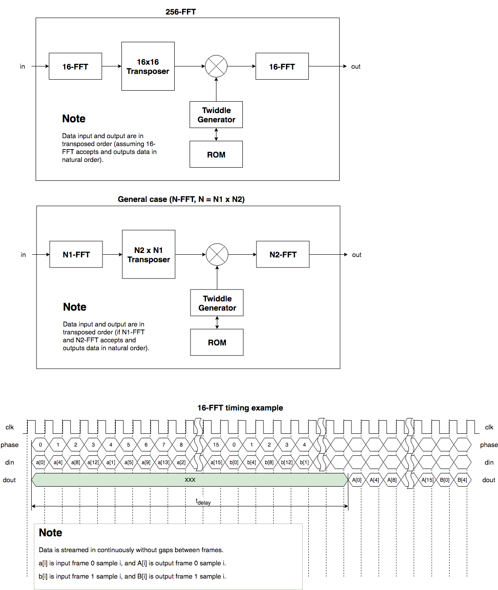

# fpga-fft
A highly optimized streaming FFT core based on Bailey's 4-step large FFT algorithm: https://www.nas.nasa.gov/assets/pdf/techreports/1989/rnr-89-004.pdf

Data input/output are continuous with no gaps between frames.

Currently only supporting power-of-two sizes and fixed point data.

Resource usage is on par with Xilinx FFT IP core, and Fmax is up to 30% higher for common sizes.

**Zynq-7000**

| Name              | Configuration                   | Device      | LUTs | FFs  | RAMB36  | DSP48E1 | Fmax     |
| ----------------- | ------------------------------- | ----------- | ---- | ---- | ------- | ------- | -------- |
| fft1024           | 24b data, 17b twiddle, rounded  | XC7Z010-1   | 1648 | 4087 | 2       | 16      | 350 MHz  |
| fft1024_wide      | 32b data, 24b twiddle, rounded  | XC7Z010-1   | 2508 | 6096 | 3       | 32      | 310 MHz  |
| fft1024_spdf_wide | 32b data, 24b twiddle, rounded  | XC7Z010-1   | 3259 | 7101 | 4       | 32      | 310 MHz  |
| fft4096           | 24b data, 17b twiddle, rounded  | XC7Z010-1   | 2073 | 5016 | 6       | 20      | 343 MHz  |

**Kintex-7**

| Name            | Configuration                    | Device      | LUTs | FFs   | RAMB36  | DSP48E1 | Fmax     |
| --------------- | -------------------------------- | ----------- | ---- | ----- | ------- | ------- | -------- |
| fft1024         | 24b data, 17b twiddle, rounded   | XC7K160T-1  | 1653 | 4087  | 2       | 16      | 458 MHz<sup>(1)</sup> |
| fft4096         | 24b data, 17b twiddle, rounded   | XC7K160T-1  | 2098 | 4942  | 6       | 20      | 458 MHz<sup>(1)</sup> |
| fft8192         | 24b data, 17b twiddle, rounded   | XC7K160T-1  | 2279 | 5760  | 14      | 24      | 458 MHz<sup>(1)</sup> |
| fft16k_2        | 24b data, 17b twiddle, rounded   | XC7K160T-1  | 2428 | 6563  | 29      | 28      | 458 MHz<sup>(1)</sup> |
| fft32k_wide     | 32b data, 24b twiddle, rounded   | XC7K160T-1  | 3982 | 10245 | 73      | 56      | 458 MHz<sup>(1)</sup> |

**Kintex Ultrascale**

| Name         | Configuration                   | Device      | LUTs | RAMB36  | DSP48E1 | Fmax     |
| ------------ | ------------------------------- | ----------- | ---- | ------- | ------- | -------- |
| fft4096      | 24b data, 17b twiddle, rounded  | XCKU025-1   | 2071 | 9       | 20      | 525 MHz<sup>(1)(2)</sup> |
| fft8192_wide | 24b data, 24b twiddle, rounded  | XCKU025-1   | 3137 | 16.5    | 48      | 525 MHz<sup>(1)(2)</sup> |
| fft32k_wide  | 32b data, 24b twiddle, rounded  | XCKU025-1   | 4222 | 76      | 56      | 501 MHz<sup>(2)</sup> |

<sup>(1)</sup> Bottlenecked by block ram maximum frequency.

<sup>(2)</sup> Additional contraints are required on BRAM synthesis. See below.

<sup>(3)</sup> Fmax numbers are based on Vivado (2019.1) timing analysis with "Performance_Explore" synthesis strategy.

# Architecture
The basic architecture is based on subdividing a size N = N1*N2 FFT into N2 FFTs of size N1 followed by reordering and multiplication by twiddle factors, then N1 FFTs of size N2.



# Usage
Top level VHDL code is generated by the script codegen/gen_fft.py. The VHDL sub-blocks in this repository are referenced by the generated code.

To generate a custom FFT size, edit the FFT layout definitions in codegen/gen_fft_layouts.py.

A layout definition looks like this:
```python
fft4096 = \
	FFT4Step(4096,
		FFT4Step(64,
			FFT4Step(16, 
				FFTBase(4, 'fft4_serial3', 'SCALE_NONE'),
				FFTBase(4, 'fft4_serial3', 'SCALE_NONE')),
			FFTBase(4, 'fft4_serial3', 'SCALE_NONE')),
		FFT4Step(64,
			FFT4Step(16, 
				FFTBase(4, 'fft4_serial3', 'SCALE_DIV_N'),
				FFTBase(4, 'fft4_serial3', 'SCALE_DIV_N')),
			FFTBase(4, 'fft4_serial3', 'SCALE_DIV_N')),
		16); # twiddleBits
```
FFTBase represents a base FFT implementation (butterfly), and FFT4Step represents the combination of two sub-FFTs to form a larger FFT of size N1*N2.

Scaling modes for fft4 are SCALE_NONE (do not scale), SCALE_DIV_N (divide by N), and SCALE_DIV_SQRT_N (divide by sqrt(n)). For best accuracy defer scaling until it is necessary (like shown above).

To use a generated FFT core it is necessary to generate all the twiddle ROM sizes used (twiddle ROM size is equal to N). For N <= 32 use gen_twiddle_rom_simple.py, and gen_twiddle_rom.py otherwise. On Linux the shell script gen_roms.sh will generate all common twiddle bit sizes and depths.

Data input and output order are described as an address bit permutation. The exact permutation varies by layout and can be found in the comments at the top of generated files. The script also has an option to generate input/output reorderers for a given FFT definition. For a natural order FFT use do_gen_fft which also generates reorderers and a wrapper (that instantiates and wires up the reorders and the FFT core).

When composing a FFT layout prefer 4-FFT butterflies over 2-FFT. The new 4-FFT butterfly (fft4_serial7) internally uses a single double-rate 2-FFT butterfly multiplexed between input and internal transposer data for the lowest possible LUT usage. No DSP units are used inside a 4-FFT butterfly. A 2-FFT butterfly is only needed for FFT sizes that are not perfect square.

**Timing constraints**

A few multi-cycle timing constraints are required (because some inner butterfly implementations deserialize the data and present data every 2 or 4 cycles to the butterfly implementation):
```
set_multicycle_path -setup -start -from [get_pins -hierarchical *fftIn_mCycle*/C] -to [get_pins -hierarchical *fftOut_mCycle*/D] 4
set_multicycle_path -hold -start -from [get_pins -hierarchical *fftIn_mCycle*/C] -to [get_pins -hierarchical *fftOut_mCycle*/D] 3

set_multicycle_path -setup -start -from [get_pins -hierarchical *fftIn_2Cycle*/C] -to [get_pins -hierarchical *fftOut_2Cycle*/D] 2
set_multicycle_path -hold -start -from [get_pins -hierarchical *fftIn_2Cycle*/C] -to [get_pins -hierarchical *fftOut_2Cycle*/D] 1
```

For Ultrascale parts you may also need to force the use of width expansion rather than depth expansion of BRAMs to meet timing. After running implementation look for failed timing paths that pass through a series of BRAMs, and constrain those BRAMs to disable cascading. The constraints will look like this:
```
set_property CASCADE_ORDER_B NONE [get_cells fft/top_core/transp/ram/ram1_reg_bram_0]
set_property CASCADE_ORDER_B NONE [get_cells fft/top_core/transp/ram/ram1_reg_bram_1]
set_property CASCADE_ORDER_B NONE [get_cells fft/top_core/transp/ram/ram1_reg_bram_2]
set_property CASCADE_ORDER_B NONE [get_cells fft/top_core/transp/ram/ram1_reg_bram_3]
set_property CASCADE_ORDER_B NONE [get_cells fft/top_core/transp/ram/ram1_reg_bram_4]
set_property CASCADE_ORDER_B NONE [get_cells fft/top_core/transp/ram/ram1_reg_bram_5]
```
The exact instance names will need to be adjusted based on the timing report.
See https://forums.xilinx.com/t5/UltraScale-Architecture/Prevent-Block-Ram-Cascade-Chain/td-p/645310

